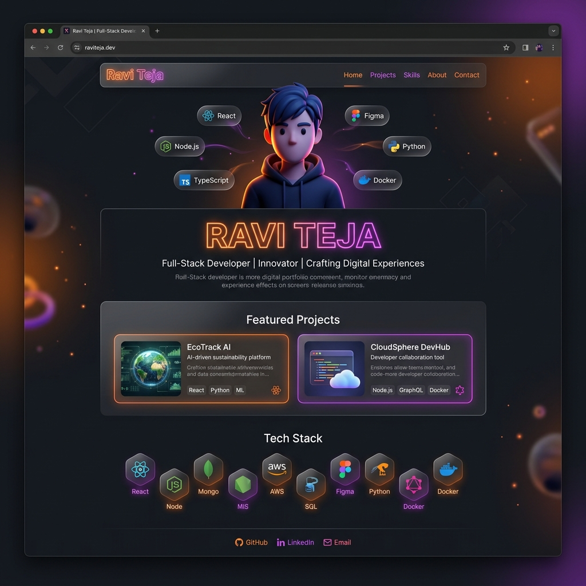

  
  
  # Ravi Teja • Full-Stack Developer
  
  **Crafting digital experiences with clean code, agentic AI, and scalable architectures.**
  
   

  
  
  
  
   

---

## ⚡ Portfolio Prototype Overview

Welcome to the source code of my personal portfolio! This project was recently migrated from a standard static HTML/JS site into a high-performance **React + Vite** architecture. It features 3D carousels, custom physics-based folder UI, GSAP scroll animations, and optimized WebP assets.

  

## 🛠️ Tech Stack & Architecture

- **Framework**: React 18, Vite
- **Styling**: Vanilla CSS, Glassmorphism UI
- **Animations**: GSAP (ScrollTrigger), custom physics & intersection observers
- **Icons**: Lucide React
- **Performance**: 100% optimized WebP assets

## 📬 Get In Touch

Have an awesome project idea or opportunity? My inbox is always open.
Contact me via the form on the website or directly at **bethuraviteja.in@gmail.com**.

  
Built with ❤️ in Bengaluru, India

